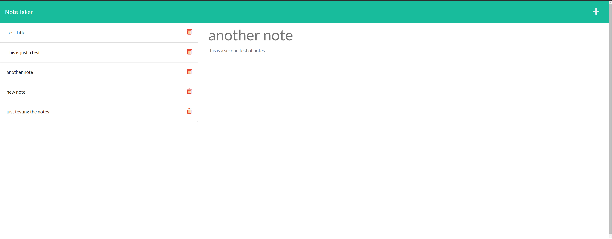

# Note Taker

   https://opensource.org/licenses/MIT

  ### Table of contents
  * [Description](#description)
  * [Installation](#installation)
  * [Usage](#usage)
  * [License](#license)
  * [Contributing](#contributing)
  * [Tests](#tests)
  * [Questions](#questions)
  * [Links](#links)
  * [Screenshots](#screenshots)
  
  ## Description 
  An app that helps you save notes using javascript, express.js. deploying it locally and also deploying the server to heroku.

  ## Installation
  to install please run this command
  npm start

  ## Usage
  to create and save notes

  ## License
     project is using MIT

  ## Contributing
  N/A

  ## Tests
  NaN

  ## Questions
  https://github.com/batemanz

  ## Links
[Github Repository](https://github.com/batemanz/note-taker.git)

[Heroku Server App](https://kilcreasenotetaker.herokuapp.com/)

  ## Screenshots
